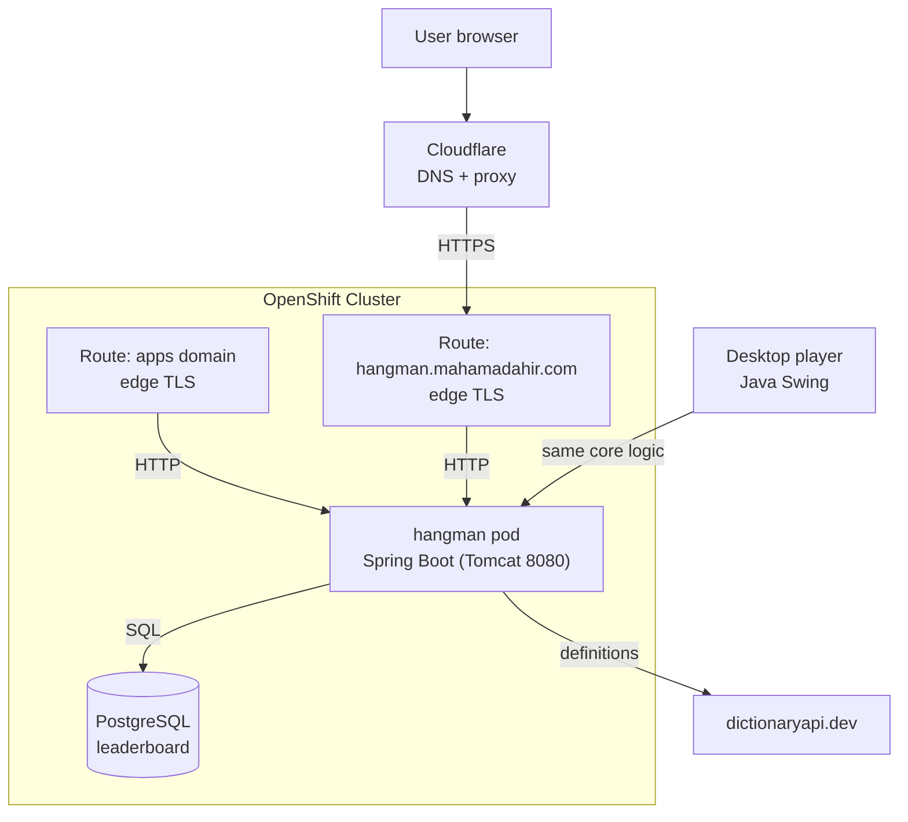

# Hangman

A Hangman game with two front ends over one shared Java core: the original Swing
desktop app, and a web version with a shared online leaderboard, deployed on
OpenShift and served at a Cloudflare-managed domain.

[]()
[]()
[]()
[]()
[]()

**Status:** Deployed · OpenShift + Cloudflare · PostgreSQL leaderboard

**Live at `https://hangman.mahamadahir.com`**, hosted on QMUL OpenShift, fronted by Cloudflare DNS.

**Stack:** Java 21 · Spring Boot 3 (web, JPA, actuator) · PostgreSQL · vanilla JS frontend · Java Swing desktop client · Docker · OpenShift

---

## Screenshots

| Home | Gameplay |
|---|---|
|  |  |
| **Win** | **Loss** |
|  |  |

---

## Features

- **One core, two clients:** the round logic, word bank, and definition lookup are shared by a Swing desktop app and a Spring Boot web app, so both behave identically.
- **Server-authoritative web play:** the secret word stays on the server and never reaches the browser until the round ends, so the shared leaderboard cannot be gamed by reading the page source.
- **Shared leaderboard:** best streak per player and difficulty, stored in PostgreSQL so scores survive restarts and redeployments.
- **Difficulty levels:** easy, medium, and hard word sets, selected before each game.
- **Streak-aware scoring:** consecutive wins build a streak; the best run reaches the leaderboard.
- **Word selection without repeats:** a difficulty's words are exhausted before any repeats.
- **On-screen and physical keyboard:** the web keyboard mirrors physical key presses with correct/incorrect feedback.
- **Post-round definitions:** each finished word shows its meaning, fetched from dictionaryapi.dev and cached per word.

---

## Architecture



**One core, two front ends.** `logic`, `model`, `persistence`, and `service` hold the
game itself: round state, the word bank, and the dictionary lookup. The Swing app
(`app`, `controller`, `ui`) and the Spring Boot web app (`web`) both build on that
core rather than reimplementing it, so a rule change lands in one place. The web
backend reuses the exact `GameLogic` that the desktop app uses, which is also why
the leaderboard is honest: the same server-side object holds the answer.

**Server-side game state.** Each web game lives in an in-memory session keyed by a
random id the browser holds. The browser only ever receives the masked word, the
remaining lives, and which letters were wrong. The full word and its definition are
sent only once the round is over. Abandoned sessions are evicted after two hours.

**Containerisation.** A multi-stage `Dockerfile` builds the Spring Boot jar with the
bundled Maven wrapper, then runs it on a slim JRE image as a non-root user, which is
what OpenShift's security model expects. OpenShift builds that image in-cluster, so
nothing is pushed from my machine.

**Database and configuration.** Locally the app runs against an in-memory H2 database
so it needs no setup. In the cluster the `SPRING_DATASOURCE_*` environment variables,
injected from a Kubernetes secret, point it at a PostgreSQL instance provisioned from
the standard OpenShift template. The leaderboard is the only persisted state.

**Health and self-healing.** Liveness and readiness probes hit the Spring Boot
actuator health endpoint, so OpenShift holds traffic back until the app is ready and
restarts it if it falls over.

**DNS and routing.** The cluster generates a platform Route host that can change under
policies outside my control, so the public address is a Cloudflare-managed domain with
a proxied CNAME pointing at the Route. The OpenShift router dispatches on the HTTP host
header, and Cloudflare forwards the original hostname, so a second Route claims
`hangman.mahamadahir.com` directly; without it the custom domain returns a 503 despite
correct DNS. Cloudflare terminates TLS for visitors with its mode set to Full and
connects back to the Route over its certificate. If the cluster ever reclaims the
project, only the CNAME target moves, since the same image runs on any container host.

**What I haven't built yet.** There is no automated test suite, no CI/CD pipeline, and
the app runs at a single replica with no autoscaling.

---

## Tech Stack

| Layer | Technology |
|---|---|
| Core | Java 21, Gson |
| Web backend | Spring Boot 3 (Web, Data JPA, Actuator) |
| Database | PostgreSQL (production), H2 (local) |
| Web frontend | Vanilla HTML / CSS / JavaScript |
| Desktop client | Java Swing |
| External data | dictionaryapi.dev (word definitions) |
| Build | Maven (via the bundled wrapper) |
| Containers / orchestration | Docker (multi-stage), OpenShift / Kubernetes |
| DNS / edge | Cloudflare (proxied CNAME, Full TLS) |

---

## Running locally

**Requirements:** Java 21 or newer. The bundled Maven wrapper (`./mvnw`) handles the
build, so a separate Maven install is optional.

### Web app

```bash
./mvnw clean package
java -jar target/hangman-game-1.0-SNAPSHOT.jar
```

Open `http://localhost:8080`. It uses an in-memory H2 database by default, so the
leaderboard resets on restart.

### Desktop app

The same jar still launches the Swing version:

```bash
java -cp target/hangman-game-1.0-SNAPSHOT.jar \
  -Dloader.main=com.hangman.app.HangmanLauncher \
  org.springframework.boot.loader.launch.PropertiesLauncher
```

Or open the project in an IDE and run `com.hangman.app.HangmanLauncher` directly. The
desktop app reads and writes `assets/words.json` and `assets/scores.json` in the
working directory.

---

## Deployment

Every cluster object is a checked-in manifest in
[`openshift/deployment.yaml`](openshift/deployment.yaml): the Deployment, the Service,
and both Routes. OpenShift builds the image from the `Dockerfile` in-cluster, the pod
reads its database credentials from a secret, and the leaderboard persists to
PostgreSQL. The Architecture section above describes how the pieces fit together. To
redeploy after a change, build the image in-cluster and restart the rollout:

```bash
oc start-build hangman --from-dir=. --follow
oc rollout restart deployment/hangman
```

---

## Project Layout

```
src/main/java/com/hangman/
├── app/          # Swing entry point (HangmanLauncher)
├── controller/   # Swing game orchestration and navigation
├── ui/           # Swing panels, screens, and dialogs
├── web/          # Spring Boot REST API, session store, leaderboard (JPA)
├── logic/        # Core round logic (shared)
├── model/        # Domain objects: Word, User (shared)
├── persistence/  # WordBank loader and ScoreTracker JSON store (shared)
└── service/      # DictionaryProvider (shared)

src/main/resources/
├── static/       # Web frontend: index.html, game.js, styles.css
├── words.json    # Bundled word list (classpath)
└── application.properties

openshift/
└── deployment.yaml   # Deployment, Service, and both Routes
```

---

## Data Files

- `assets/words.json`: the master word list, also bundled onto the classpath for the web app
- `assets/scores.json`: the desktop app's per-player statistics, saved between sessions

The web leaderboard lives in PostgreSQL, not in these files.

---

## Roadmap

- [x] Persistent score tracking per user
- [x] Difficulty selection and streak-aware scoring
- [x] Web version with a shared PostgreSQL leaderboard
- [x] Containerised deployment on OpenShift behind a Cloudflare domain
- [ ] Automated test suite and CI/CD
- [ ] Daily challenge mode with rotating curated word sets
- [ ] Localised UI strings and multiple languages

---

## Reference

- [`UPGRADE_TO_JAVA_21.md`](UPGRADE_TO_JAVA_21.md) — notes on moving the build to Java 21.
- `ProgressTracker.html` — an interactive milestone board backed by `progress-data.js`, viewable in any browser. Its checkboxes persist locally via `localStorage`.
